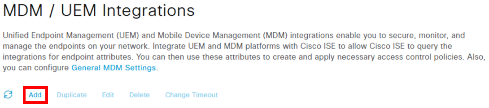
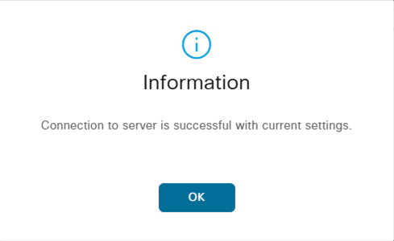
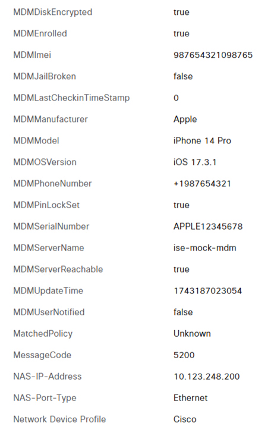

# Mock MDM server for ISE

This project aims to develop a mock Mobile Device Management (MDM) system that can be integrated
with Cisco Identity Services Engine (ISE). The project utilizes the FastAPI framework to simulate
an MDM server, providing essential API endpoints that return structured XML responses as expected
by Cisco ISE.
 
## Use Case Description

This code provides a simulated Mobile Device Management (MDM) system designed to integrate
seamlessly with Cisco Identity Services Engine (ISE). It is an essential tool for organizations
aiming to test and validate their network security solutions and device management policies without
incurring the costs and risks associated with a live MDM system.

The solution manages device information using a YAML file, streamlining the configuration and
updates of device attributes. It allows for querying device attributes based on various criteria,
including MAC address and compliance status, providing flexibility to test different scenarios.
A crucial feature of this solution is the normalization of MAC addresses, ensuring consistent
querying regardless of their provided format.

The mock MDM system utilizes FastAPI to create API endpoints that emulate the responses of a real
MDM system, enabling Cisco ISE to interact with it as if it were genuine. This setup is ideal for
facilitating comprehensive testing and validation processes.

## Installation

Clone the repo:

```bash
git clone https://github.com/chetanph/ise-mock-mdm.git

cd ise-mock-mdm
```

Create the virtual environment and activate it:

```bash
python3 -m venv .venv

source .venv/bin/activate
```

Install dependencies

```bash
pip install -r requirements.txt
```

## Configuration

The mock MDM server code is designed to be configurable, primarily through its use of an external
YAML file (`devices.yaml`) to define device attributes. This setup allows users to easily adjust
the device data without modifying the core Python code. Below are the details on how to configure
and utilize this flexibility:

### Configuration Details

####  `devices.yaml` File

The `devices.yaml` file is the primary configuration file where you define the attributes of
devices that the mock MDM server will manage. Here’s how you can configure it:

| **Attribute**                      | **Description**                                                                                                                    |
|------------------------------------|------------------------------------------------------------------------------------------------------------------------------------|
| **MAC Address**                    | Each device entry starts with a MAC address, formatted with or without colons (e.g., `AABBCCDDEEFF` or `00:26:B4:24:FE:B4`). The server normalizes these addresses for consistency. |
| **register_status**                | Indicates if the device is registered (boolean).                                                                                   |
| **compliance**                     | Includes `status` (boolean), `failure_reason`, and `remediation` messages.                                                         |
| **disk_encryption_on**             | Boolean value indicating if disk encryption is enabled.                                                                            |
| **pin_lock_on**                    | Boolean value indicating if the pin lock is enabled.                                                                               |
| **jail_broken**                    | Boolean indicating if the device is jailbroken.                                                                                    |
| **manufacturer**                   | The device manufacturer's name (e.g., Samsung, Apple).                                                                             |
| **model**                          | The device model (e.g., Galaxy S21, iPhone 14 Pro).                                                                                |
| **imei, meid, udid, serial_number**| Unique identifiers for the device.                                                                                                 |
| **os_version**                     | The operating system version running on the device.                                                                                |
| **phone_number**                   | The device's phone number.                                                                                                         |

Example entry in `devices.yaml`:

```yaml
AA:BB:CC:DD:EE:FF:
  register_status: true
  compliance:
    status: false
    failure_reason: Alf does not like this phone
    remediation: Alf wants a new phone
  disk_encryption_on: true
  pin_lock_on: true
  jail_broken: false
  manufacturer: Samsung
  model: Galaxy S21
  imei: 123456789012345
  meid: A0123456789012
  udid: 2b6f0cc904d137be2e1730235f5664094b831186
  serial_number: SAMSNG12345678
  os_version: Android 13
  phone_number: "+1234567890"
```

### Making Configuration Changes

1. **Add New Devices:** Simply add new entries in the `devices.yaml` file following the existing
structure. Ensure that each device has a unique MAC address.
2. **Modify Device Attributes:** Change any attribute values as needed to simulate different device
states or configurations.
3. **Remove Devices:** Delete the entire block for a device to remove it from the mock MDM server.

### Reloading Configuration

Since the server reads the `devices.yaml` file each time a request is made to the
`/ise/mdm/api/devices/` endpoint, you don't need to restart the server for changes to take effect.
Simply save the changes to `devices.yaml`, and they will be reflected in subsequent API calls.

## Usage

### Step 1: Prepare the devices.yaml File

Navigate to the project directory and ensure the `devices.yaml` file is present.

You can add more devices by following the same format, adjusting the attributes as needed for
testing different scenarios.

### Step 2: Generate a Self-Signed SSL Certificate

Use OpenSSL to generate a self-signed certificate within the project directory:

```bash
openssl req -x509 -newkey rsa:4096 -keyout key.pem -out cert.pem -days 364 -nodes
```

Follow the prompts to enter your certificate details. This certificate will be used for secure
communication.

### Step 3: Configure Hostname Resolution

#### Option A: Modify Hosts File

If a DNS server is not available, add an entry to your system's hosts file to resolve the mock
server's hostname to your local machine's IP address:

- **Linux/Mac:** Open `/etc/hosts` with a text editor using sudo:

  ```bash
  sudo nano /etc/hosts
  ```

- **Windows:** Open `C:\Windows\System32\drivers\etc\hosts` with a text editor as Administrator.

Add the following line, replacing 127.0.0.1 with your local IP if necessary:

```
127.0.0.1 ise-mock-mdm.cisco.lab
```

#### Option B: Create DNS Record

If a DNS server is available, create an A record to point the hostname to your server's IP address.
Follow your DNS management console instructions for creating and managing DNS records.

### Step 4: Run the Mock MDM Server

With the virtual environment activated, start the server using Uvicorn:

```bash
uvicorn mdm:app --reload --host 0.0.0.0 --port 9443 --ssl-keyfile=key.pem --ssl-certfile=cert.pem
```

### Step 5: Interact with the Mock MDM Server

- **Check MDM Info:** Use the following command to verify the MDM server information:

  ```bash
  curl --insecure 'https://ise-mock-mdm.cisco.lab:9443/ciscoise/mdminfo/?ise_api_version=3'
  ```

  This will return XML data with MDM server details.

- **Retrieve Non-Compliant Devices:** To fetch a list of devices based on compliance status, use:

  ```bash
  curl --insecure -vvv 'https://ise-mock-mdm.cisco.lab:9443/ise/mdm/api/devices/?paging=0&querycriteria=compliance&value=false&deviceidentifier=macaddress&filter=all'
  ```

  This retrieves XML data for devices that are marked as non-compliant.

### DevNet Sandbox

https://devnetsandbox.cisco.com/DevNet/catalog/ise-sandbox

## How to test the software

The optimal way to test the mock MDM server is by integrating it into your Cisco Identity Services
Engine (ISE) deployment. Follow the steps below to ensure a smooth integration and verification
process.

### Pre-Integration Setup

Ensure your `ise-mock-mdm` server is installed, configured, and running. Detailed instructions for
these steps are provided in this `README` file. Once the server is operational, proceed to the
integration with ISE.

### Integrating with ISE

#### 1. Access ISE Configuration:

- Log in to the ISE Primary PAN node.
- Go to `Administration > System > Certificates > Trusted Certificate` and import the mock
MDM server certificate.
- Navigate to `Administration > Network Resources > External MDM`.
- Click on the `Add` button to configure a new MDM server.

  

#### 2. Fill in the New MDM Server Form:

| **Field**                             | **Description**                                                |
|---------------------------------------|----------------------------------------------------------------|
| **MDM / UEM Integration Name**        | Enter a name for your MDM integration, such as `ise-mock-mdm`. |
| **Server Type**                       | Select **Mobile Device Manager**.                              |
| **Authentication Type**               | Select **Basic**.                                              |
| **Hostname / IP Address**             | Provide the hostname of your server, e.g., `mdm.cisco.lab`.    |
| **Instance Name**                     | Leave this option empty.                                       |
| **Username**                          | Although the `ise-mock-mdm` server does not authenticate requests, this field is mandatory. Enter a placeholder, such as  `username`. |
| **Password**                          | Similarly, enter a placeholder, such as `password`.            |
| **Polling Interval**                  | The default value is typically sufficient; leave it as is.     |
| **MDM/UEM Device Compliance Timeout** | Leave the default value unchanged.                             |
| **Compliance Cache Expiration Time**  | Leave the default value unchanged.                             |
| **Status**                            | Select **Enabled**.                                            |
| **Device Identifier**                 | Check **Legacy MAC Address** option only.                      |

#### 3. Test Connection:

- Before saving the form, click on the `Test Connection` button. If configured correctly,
you should receive a success message.

  

#### 4. Save Configuration:

- Click the Save button to finalize the setup.

### Policy Creation and Testing

With the MDM integration configured, you can now create policies using MDM attributes. Ensure that
your `devices.yaml` file includes the MAC addresses of the endpoints you are testing.

When an endpoint authenticates against the ISE deployment, monitor the terminal running the MDM
server for logs similar to this:

```
INFO:     10.123.248.215:54620 - "GET /ise/mdm/api/devices/?paging=0&querycriteria=macaddress&value=0026B424FEB4&filter=all HTTP/1.1" 200 OK 
```

If the request is authorized according to your ISE policies, you should be able to view the
device's MDM attributes under `Context Visibility > Endpoints` in the ISE dashboard.



By following these steps, you can effectively test the integration and functionality of your mock
MDM server within a Cisco ISE environment. Adjust your policies and device configurations as needed
to simulate various scenarios and validate the system's response.

For a deeper understanding of the interaction between ISE and the mock MDM server, please refer to
the documentation below:

[Mobile Device Management APIs](https://developer.cisco.com/docs/identity-services-engine/latest/version-3/)

## Getting help

If you have questions, concerns, bug reports, etc., please create an issue against this repository.

## Author(s)

This project was written and is maintained by the following individuals:

* Chetankumar Phulpagare <cphulpag@cisco.com>
* Israel Fernandez <isrferna@cisco.com>
